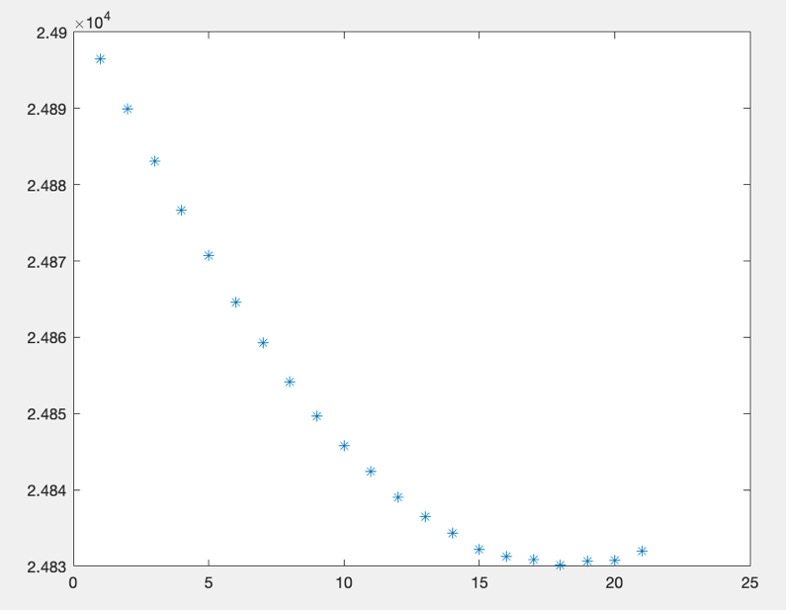
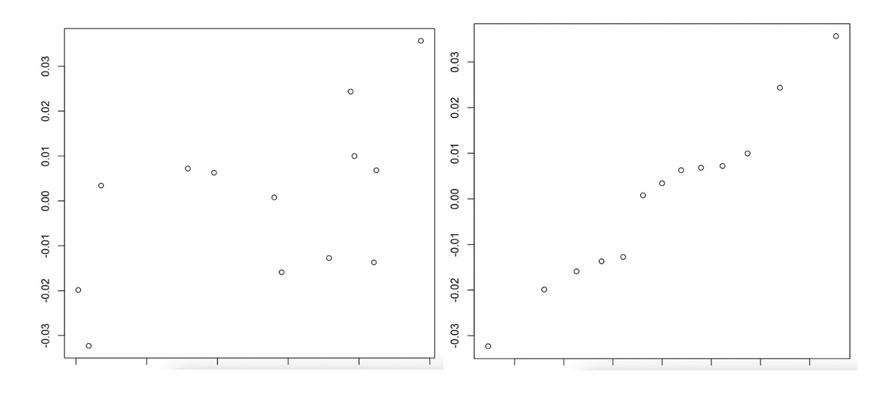

# Analyst

## Education

Mathematics, B.S. from University of North Texas
- GPA: 3.9

## Technical Skills

- Beginner: Python | SQL
- Intermediate: MATLAB | R | Power BI | Tableau
- Advanced: Excel

## Projects

### **Tableau**

#### **Border Crossings**

I took Border Crossing Data from Data.gov collected from the Bureau of Transportation Statistics. I took this data and created a dashboard on Tableau that shows various dimensions of this data. From this dashboard, conclusions can be seen clearly or used to do further analysis. 

[Data](https://catalog.data.gov/dataset/border-crossing-entry-data-683ae)

[Report](https://github.com/gracevmath/gracevmath.github.io/blob/main/Border%20Crossing%20Data.twb)

### **MATLAB**

#### **Substitute Teacher Pool**
  
I took a project prompt from **A First Course in Mathematical Modeling: Third Edition** by Frank R. Giordano, Maurice D. Weir, and William P. Fox. I used the data given and created a program to test and re-test values for sample size using MATLAB. I then wrote up a report that showed the results of each test and my conclusions thereafter. 

[Information & Data](https://github.com/gracevmath/gracevmath.github.io/blob/main/Informationnn.pdf)

[Code](https://github.com/gracevmath/gracevmath.github.io/blob/main/MATLAB%20project%20code.pdf)

[Report](https://github.com/gracevmath/gracevmath.github.io/blob/main/modeling%20project.pdf)

### **R**

#### **Walking Analysis**

I took already cleaned data from a study comparing walking styles and how energy efficient these "silly" walking styles were. I completed a full analysis of this data and looked at a specific character's data compared with other measures included in the data. I then compiled a report stating my findings and including the analyses I completed using R. 

[Information](https://github.com/gracevmath/gracevmath.github.io/blob/main/Information.pdf)

[Data](https://github.com/gracevmath/gracevmath.github.io/blob/main/WalkData4650.csv)

[Code](https://github.com/gracevmath/gracevmath.github.io/blob/main/WalkDataCode.txt)

[Report](https://github.com/gracevmath/gracevmath.github.io/blob/main/stats%20final%20project.pdf)
